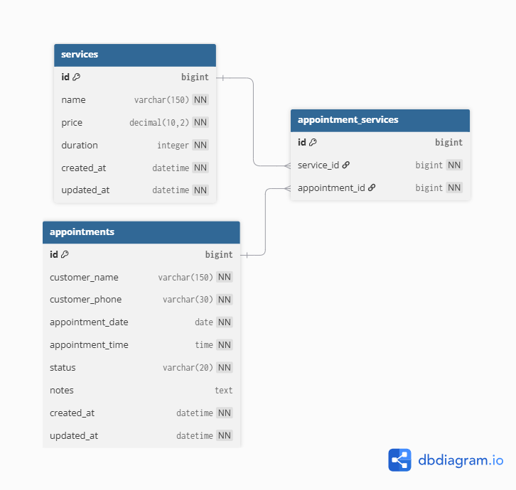

# Salon Booking System — Backend API

A REST API for managing salon services and customer appointments. It is built
with Django, Django REST Framework, and SQLite. The API uses function-based
views and does not require authentication.

## Features

- Create, list, update, and delete salon services.
- Create, list, filter, update the status of, and delete appointments.
- Support one or more services per appointment.
- Calculate appointment price and duration on the server.
- Validate required fields, service pricing, durations, dates, times, and
  appointment status values.
- Prevent booking the same service at the same date and time when the existing
  appointment has not been cancelled.
- Preserve appointment history by rejecting deletion of services already used
  by appointments.
- Allow browser requests from the frontend development server at
  `http://localhost:3000` via CORS.

## Tech stack

- Python 3.11+
- Django 5.2
- Django REST Framework
- SQLite
- django-cors-headers

## Project structure

```text
Salon-Booking-Backend/
├── api/                    # Models, function-based API views, URLs, tests
├── api/migrations/         # SQLite database schema migrations
├── config/                 # Django project configuration
├── manage.py
├── requirements.txt
└── db.sqlite3              # Local SQLite database (created/updated by migrate)
```

## Database schema

The database uses a many-to-many relationship: an appointment can include one
or more services, and a service can be part of multiple appointments.



## Setup and run

### 1. Clone the repository

```bash
git clone https://github.com/bhattaraiprati/Salon-Booking-System.git
cd Salon-Booking-Backend
```

### 2. Create and activate a virtual environment

Windows PowerShell:

```powershell
python -m venv .venv
.\.venv\Scripts\Activate.ps1
```

macOS/Linux:

```bash
python -m venv .venv
source .venv/bin/activate
```

### 3. Install dependencies

```bash
pip install -r requirements.txt
```

### 4. Create the database schema

```bash
python manage.py migrate
```

SQLite is configured by default. No separate database server or credentials are
needed.

### 5. Run the API

```bash
python manage.py runserver
```

The API is then available at `http://127.0.0.1:8000/api/`.

## Run tests

```bash
python manage.py test api
```

## API reference

All requests and responses use JSON. Dates use `YYYY-MM-DD` and times use
24-hour `HH:mm` format. Base URL: `/api`.

| Method | Endpoint | Description |
| --- | --- | --- |
| `GET` | `/services` | List all services |
| `POST` | `/services` | Create a service |
| `PUT` | `/services/:id` | Update a service |
| `DELETE` | `/services/:id` | Delete a service |
| `GET` | `/appointments` | List appointments |
| `POST` | `/appointments` | Create an appointment |
| `PATCH` | `/appointments/:id/status` | Update appointment status |
| `DELETE` | `/appointments/:id` | Delete an appointment |

Both trailing-slash and non-trailing-slash forms are accepted.

### Create a service

```http
POST /api/services
Content-Type: application/json
```

```json
{
  "name": "Haircut",
  "price": 500,
  "duration": 30
}
```

`price` is in NPR and `duration` is in minutes. Price must be positive and
duration must be greater than zero.

### Create an appointment

```http
POST /api/appointments
Content-Type: application/json
```

```json
{
  "customer_name": "Sita Thapa",
  "customer_phone": "9808741220",
  "service_ids": [1, 2],
  "appointment_date": "2026-09-18",
  "appointment_time": "11:00",
  "notes": "Sensitive skin products only"
}
```

The API calculates `total_price` and `total_duration` from the selected
services; these values must not be provided by clients.

### Filter appointments

`GET /api/appointments` supports optional query parameters:

```text
?status=Confirmed
?date=2026-09-18
?search=sita
?page=1&page_size=20
```

Allowed status values are `Pending`, `Confirmed`, `Completed`, and
`Cancelled`.

### Update appointment status

```http
PATCH /api/appointments/1/status
Content-Type: application/json
```

```json
{ "status": "Confirmed" }
```

## Validation and business rules

- Customer name, phone number, service IDs, date, and time are required.
- At least one existing service must be selected.
- A non-cancelled appointment cannot use a service already booked at the same
  date and time.
- Invalid request data returns `400 Bad Request`.
- Unknown service or appointment IDs return `404 Not Found`.
- Appointment conflicts and deletion of a service used by an appointment return
  `409 Conflict`.

Example conflict response:

```json
{
  "detail": "One or more selected services are already booked at this date and time.",
  "fields": { "service_ids": [1] }
}
```

## Frontend and submission notes

This repository currently contains the backend API. For the assessment's final
public GitHub submission, ensure the repository also contains the frontend
source code (or use a parent repository that contains both projects), and add
the final public repository URL here before submitting.

## CORS

The backend permits the local frontend origin `http://localhost:3000`. To use a
different frontend host, add it to `CORS_ALLOWED_ORIGINS` in
`config/settings.py`.
